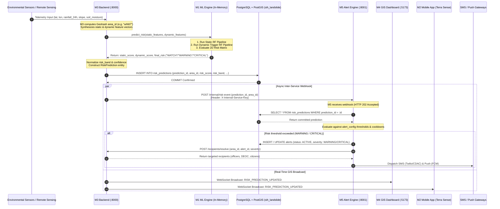
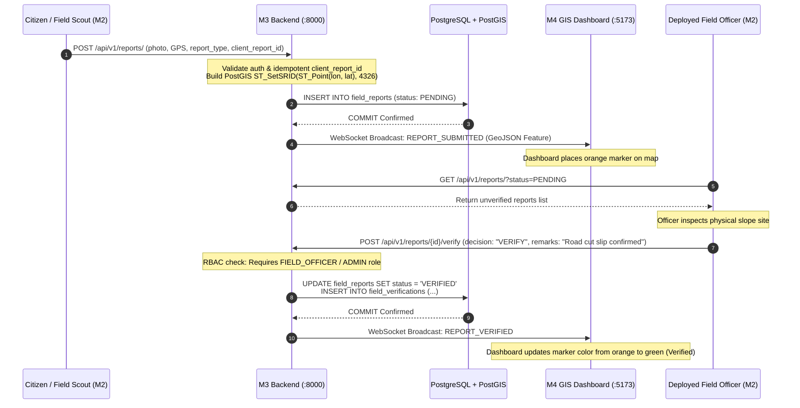
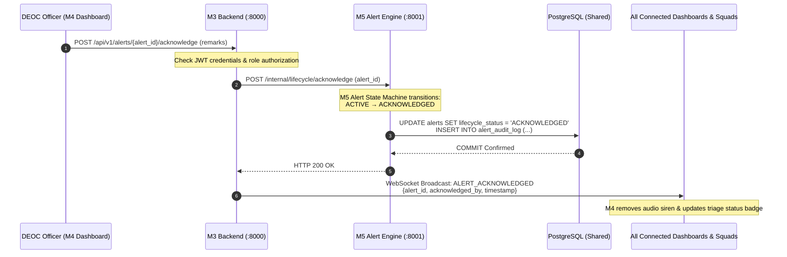
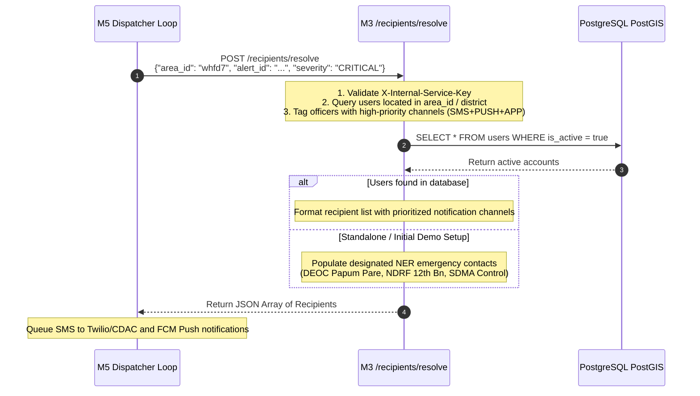

# NER-LEWS Data Flow Architecture
## Smart India Hackathon 2026 — Problem Statement ID: 26001
**AI-Based Early Warning and Smart Landslide Risk Monitoring System for the North-Eastern Region (NER)**  
*Cross-Module Data Flow Specifications: M1, M2, M3, M4, and M5*

---

## 1. Primary End-to-End Data Pipelines

The system executes four primary operational data flows:
1. **Automated Risk Ingestion & Alert Dispatch Pipeline** (Sensors $\rightarrow$ M1 $\rightarrow$ M3 $\rightarrow$ M5 $\rightarrow$ Citizens / Responders)
2. **Crowdsourced Field Hazard Reporting & Verification Flow** (M2 Mobile $\rightarrow$ M3 PostGIS $\rightarrow$ M4 Dashboard)
3. **Alert Lifecycle & Incident Command Acknowledgement Flow** (M4 / M2 $\rightarrow$ M3 $\rightarrow$ M5 State Machine $\rightarrow$ WebSocket Broadcast)
4. **Geo-Targeted Recipient Resolution Flow** (M5 $\rightarrow$ M3 Spatial Engine $\rightarrow$ Targeted Delivery Queue)

---

## 2. Pipeline 1: Automated Risk Ingestion & Alert Dispatch



### Detailed Steps:
1. **Telemetry Ingestion**: Ingests GPS coordinates `(lat, lon)`, 24-hour cumulative rainfall (mm), slope angle (deg), and volumetric soil moisture ratio.
2. **Geohash Encoding**: M3 derives a Base32 Geohash (precision 5, e.g. `whfd7`, representing a ~4.9 km $\times$ 4.9 km cell).
3. **M1 ML Inference**:
   - `static_features`: Ingests terrain elevation, slope, curvature, soil type, NDVI, and distance to roads/rivers.
   - `dynamic_features`: Ingests multi-day rainfall accumulators (1d, 3d, 7d, 14d, 30d) and soil moisture changes.
   - Evaluates the dual Random Forest models and looks up the final risk classification in `RISK_MATRIX`.
4. **Database Persistence**: M3 writes an authoritative record to `risk_predictions`.
5. **M5 Evaluation Webhook**: M3 fires a non-blocking `POST /internal/risk-event` containing the `prediction_id` and `area_id`.
6. **M5 Authoritative Re-read**: M5 queries `risk_predictions` directly in PostgreSQL by `prediction_id` (ensures zero data tampering over HTTP).
7. **State Transition & Escalation**: M5 checks for existing alerts in `area_id`. If risk escalated (e.g. `WATCH` $\rightarrow$ `CRITICAL`), it transitions the alert to `CRITICAL` and resets notification dampening.
8. **Real-time Map Stream**: M3 broadcasts the update over WebSockets (`/ws/dashboard`) to M4 Command Center and M2 Mobile Clients.

---

## 3. Pipeline 2: Crowdsourced Field Reporting & Verification



---

## 4. Pipeline 3: Alert Acknowledgement & Operational Triage



---

## 5. Pipeline 4: Geo-Targeted Recipient Resolution

When M5 determines an alert must be dispatched, it resolves recipients via M3 without touching the `users` table directly:



---

## 6. Exact Inter-Module Data Contracts

### 6.1 M1 ML Input / Output Contract (In-Memory Python)
**Input to `M1.predict_risk(static_features, dynamic_features)`**:
```python
static_features = {
    "elevation": 1150.0,
    "slope": 32.0,
    "curvature": 0.05,
    "soil_type": "Loam",
    "ndvi_2017": 0.55,
    "distance_to_river_m": 350.0,
    "distance_to_road_m": 120.0,
    "distance_to_village_m": 450.0,
    "aspect_sin": 0.40,
    "aspect_cos": 0.60,
}
dynamic_features = {
    "rainfall_1d": 110.0,
    "rainfall_3d": 242.0,
    "rainfall_7d": 495.0,
    "rainfall_14d": 770.0,
    "rainfall_30d": 1210.0,
    "rainfall_max_3d": 143.0,
    "rainfall_max_7d": 176.0,
    "rainy_days_7d": 5,
    "rainy_days_14d": 9,
    "rainy_days_30d": 18,
    "soil_moisture": 0.78,
    "soil_moisture_3d_mean": 0.741,
    "soil_moisture_7d_mean": 0.702,
    "soil_moisture_change_3d": 0.04,
    "soil_moisture_change_7d": 0.08,
}
```

**Output from `M1.predict_risk`**:
```json
{
  "static_score": 0.3914,
  "static_class": "MODERATE",
  "dynamic_score": 0.2198,
  "dynamic_class": "MODERATE",
  "final_risk": "MODERATE"
}
```

---

### 6.2 M3 $\rightarrow$ M5 Internal Risk Webhook
- **URL**: `POST http://localhost:8001/internal/risk-event`
- **Headers**:
  - `Content-Type: application/json`
  - `X-Internal-Service-Key: m3-m5-internal-shared-key`
- **Payload**:
```json
{
  "prediction_id": "c7a8b3e2-9f12-4d1a-8c5e-7a1b2c3d4e5f",
  "area_id": "whfd7"
}
```

---

### 6.3 M5 $\rightarrow$ M3 Recipient Resolution Contract
- **URL**: `POST http://localhost:8000/recipients/resolve` (also `/api/v1/recipients/resolve`)
- **Request Payload**:
```json
{
  "area_id": "whfd7",
  "alert_id": "9b1deb4d-3b7d-4bad-9bdd-2b0d7b3dcb6d",
  "severity": "CRITICAL"
}
```
- **Response Payload**:
```json
[
  {
    "recipient_id": "deoc-papum-pare-01",
    "phone_number": "+919876543210",
    "device_token": "fcm_deoc_papum_pare",
    "preferred_channels": ["SMS", "PUSH", "APP"],
    "priority": "CRITICAL",
    "preferred_locale": "en"
  },
  {
    "recipient_id": "ndrf-12bn-itanagar-duty",
    "phone_number": "+919876543211",
    "device_token": "fcm_ndrf_itanagar",
    "preferred_channels": ["SMS", "PUSH"],
    "priority": "CRITICAL",
    "preferred_locale": "en"
  }
]
```

---

### 6.4 M3 $\rightarrow$ M4/M2 Real-Time WebSocket Event Contract
- **Endpoint**: `ws://localhost:8000/ws/dashboard`
- **Risk Prediction Event**:
```json
{
  "event": "RISK_PREDICTION_UPDATED",
  "data": {
    "prediction_id": "c7a8b3e2-9f12-4d1a-8c5e-7a1b2c3d4e5f",
    "area_id": "whfd7",
    "latitude": 27.55,
    "longitude": 93.65,
    "risk_score": 0.82,
    "risk_band": "CRITICAL",
    "risk_level": "CRITICAL",
    "timestamp": "2026-09-20T12:00:00Z"
  }
}
```
- **Alert Acknowledged Event**:
```json
{
  "event": "ALERT_ACKNOWLEDGED",
  "data": {
    "alert_id": "9b1deb4d-3b7d-4bad-9bdd-2b0d7b3dcb6d",
    "area_id": "whfd7",
    "severity": "CRITICAL",
    "status": "ACKNOWLEDGED",
    "acknowledged_by": "officer-uuid-001",
    "timestamp": "2026-09-20T12:02:15Z"
  }
}
```
- **Field Report Verified Event**:
```json
{
  "event": "REPORT_VERIFIED",
  "data": {
    "report_id": "e2f1a0b3-4c5d-6e7f-8a9b-0c1d2e3f4a5b",
    "decision": "VERIFY",
    "officer_id": "officer-uuid-001",
    "timestamp": "2026-09-20T12:05:00Z"
  }
}
```
